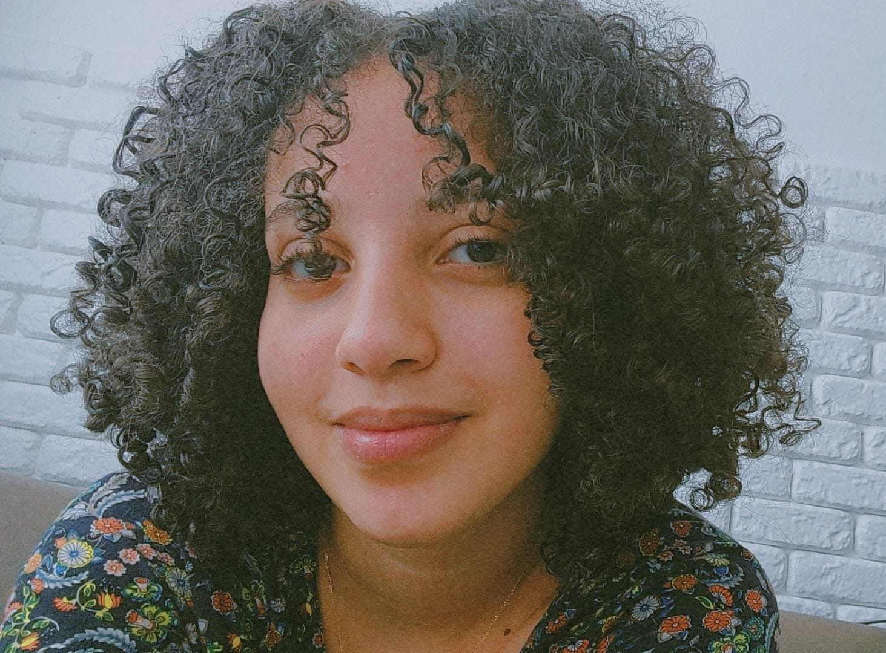

# Maria Beatriz Lacerda de Oliveira

## Apresentação

* 20 anos
* Vitória da Conquista-BA
* [beatrizlacerda2011@gmail.com](beatrizlacerda2011@gmail.com)

## Instituição de Ensino

* Instituto Federal da Bahia - IFBA

## Área de Experiência

### Back-End - Básico

Criação de projetos pessoais para estudo.

## Tecnologias 

* Java OO - Básico
* Python - Básico
* Linux - Intermediário
* Git - Intermediário

## Hobbies 

* Criar pixel art 
* Jiu Jitsu

## Resumo do meu aprendizado 

* Git - Acabei de fazer um curso bem completo de git, onde aprendi a versionar código de várias formas e aprendi utilizar a plataforma GitHub e formatar arquivos .md com Markdown.
* Linux - Aprendi com esse curso vários comandos e flags usadas para manipular diretórios e arquivos, e me deu uma noção de Shell script.
* Java OO / Sprint Boot - Estou fazendo um curso e desenvolvendo junto com o curso um jogo de xadrês em java. 
* SQL - Para análise de dados e criação e modelação de tabelas.

