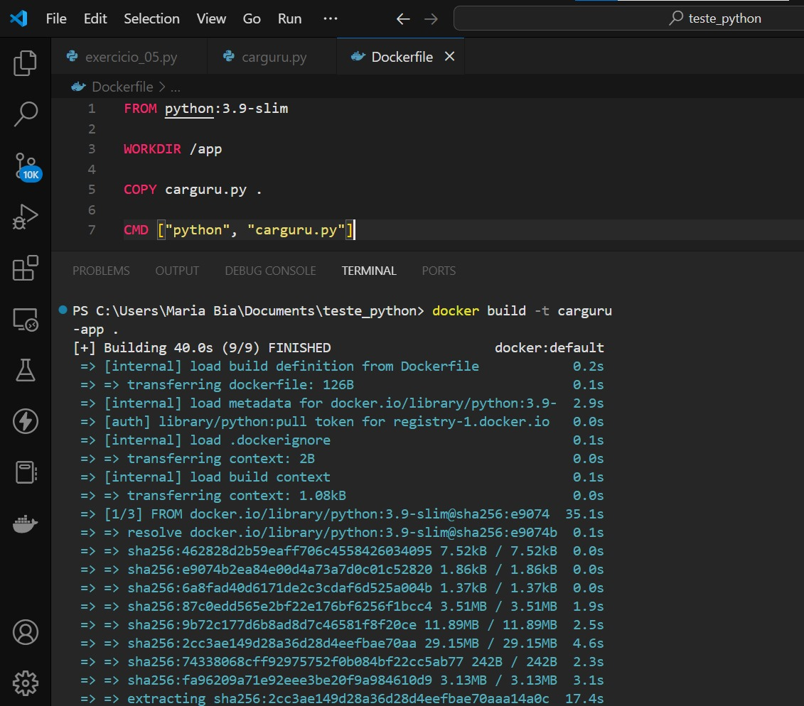
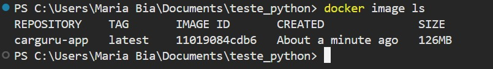
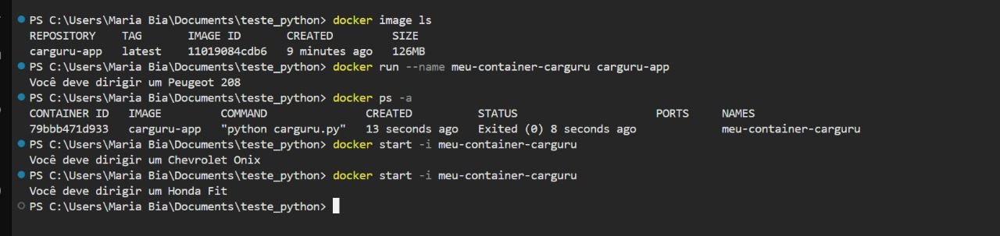
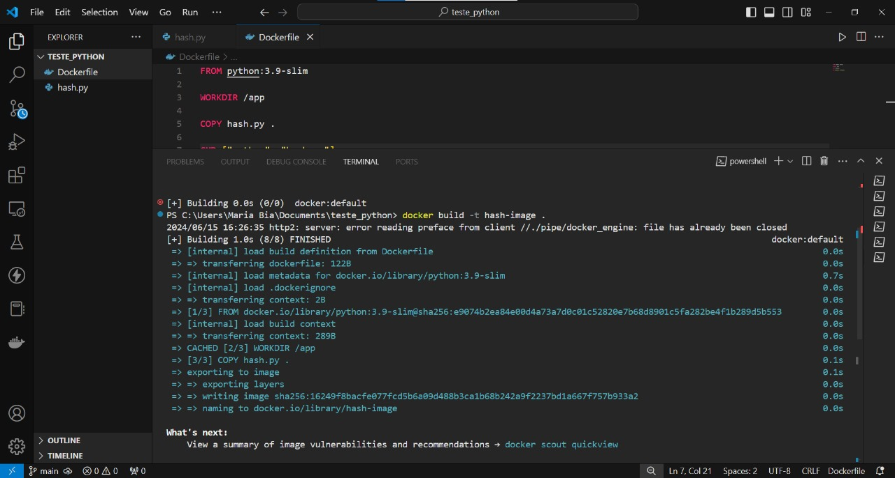
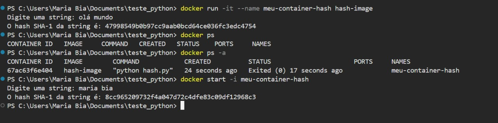

## 1 - Desafio Sprint 04

[Desafio](Desafio)

## Exercício 

[Exercicio_de_ETL](Exercicio_Python)

## 2 - Certificados

### 2.1 - AWS certificate

[AWS_certificate](Certificado/13660_3_5480475_1715538696_AWS%20Course%20Completion%20Certificate.pdf)

### 2.2 - Docker

[SQL](Certificado/certificado_docker.pdf)

## 3 - Evidências

