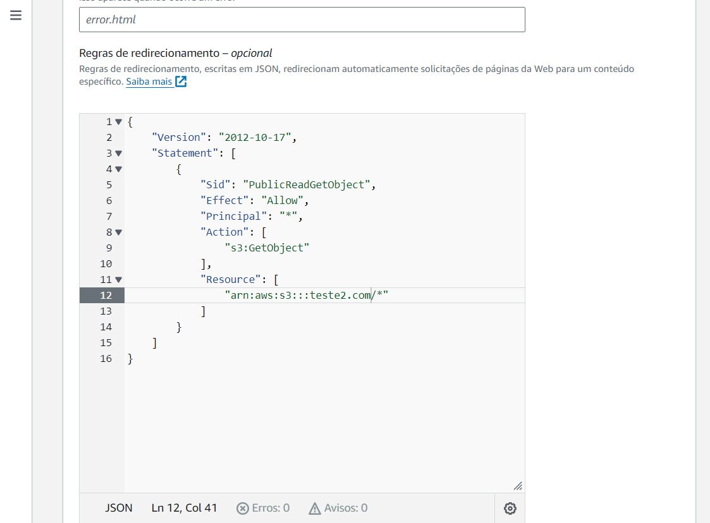
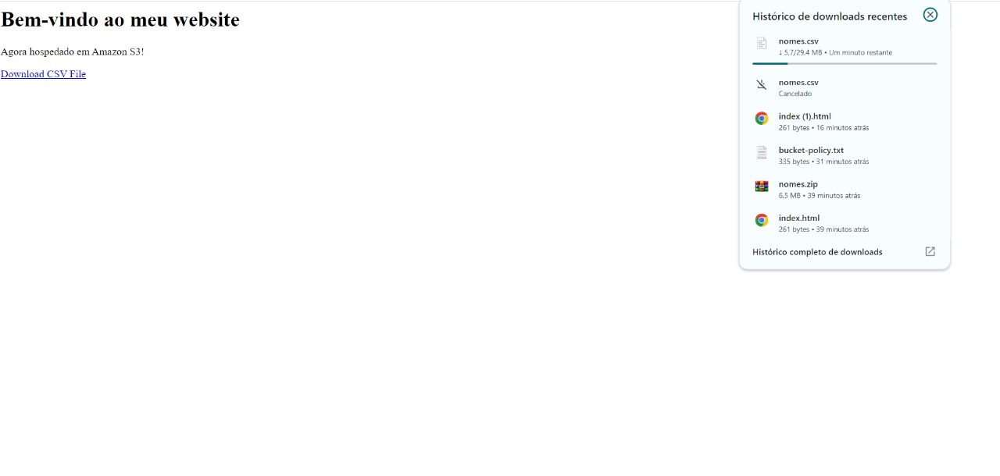
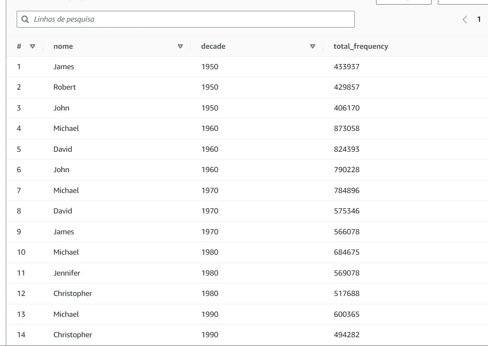
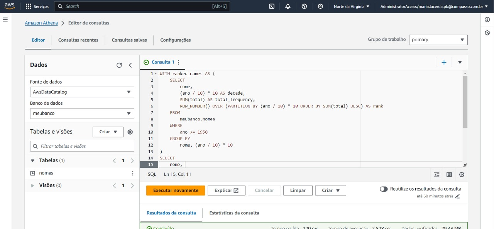
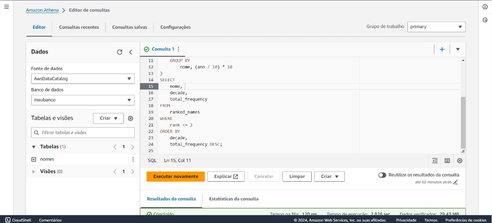
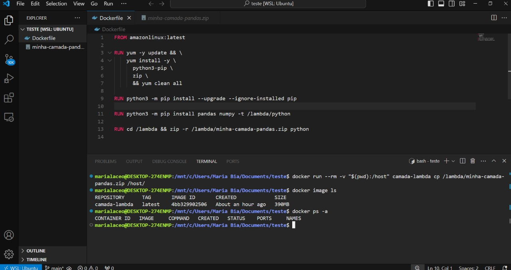
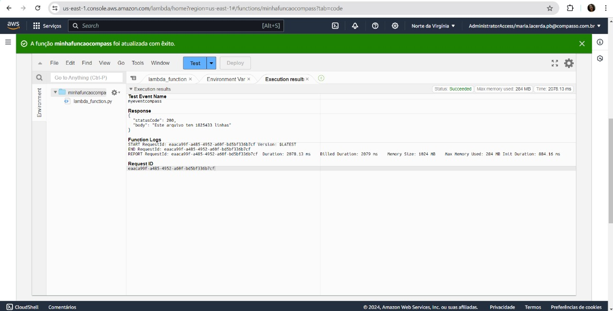

## 1 - Desafio Sprint 06

[Desafio](Desafio)

## 2 - Certificados

### 2.1 - AWS certificate

[AWS_certificate_1](Certificado/13246_3_5480475_1718136510_AWS%20Course%20Completion%20Certificate.pdf)

[AWS_certificate_2](Certificado/13655_3_5480475_1720379893_AWS%20Course%20Completion%20Certificate.pdf)

[AWS_certificate_3](Certificado/14908_3_5480475_1720381060_AWS%20Course%20Completion%20Certificate.pdf)

[AWS_certificate_4](Certificado/1851_3_5480475_1718133441_AWS%20Course%20Completion%20Certificate.pdf)

[AWS_certificate_5](Certificado/19359_5_5480475_1720201906_AWS%20Skill%20Builder%20Course%20Completion%20Certificate.pdf)

[AWS_certificate_6](Certificado/5838_3_5480475_1720202468_AWS%20Course%20Completion%20Certificate.pdf)

[AWS_certificate_7](Certificado/6256_3_5480475_1720202190_AWS%20Course%20Completion%20Certificate.pdf)

[AWS_certificate_8](Certificado/6339_3_5480475_1720380007_AWS%20Course%20Completion%20Certificate.pdf)

[AWS_certificate_9](Certificado/8827_5_5480475_1720379658_AWS%20Skill%20Builder%20Course%20Completion%20Certificate.pdf)

## 3 - Evidências dos Laboratórios

### 3.1 - Laboratório S3

### 3.2 - Laboratório Athena

### 3.3 - Laboratório Lambda

