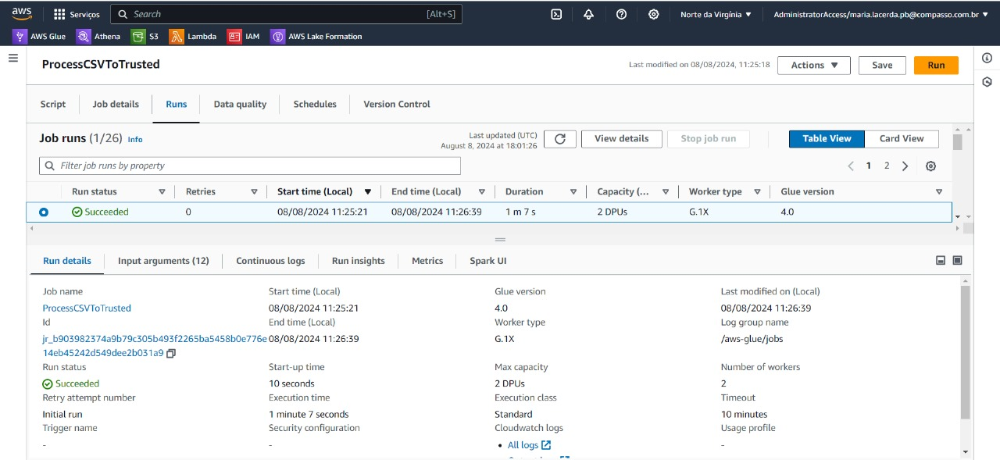
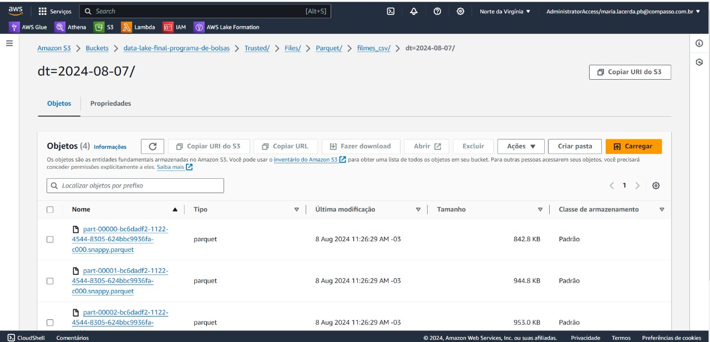
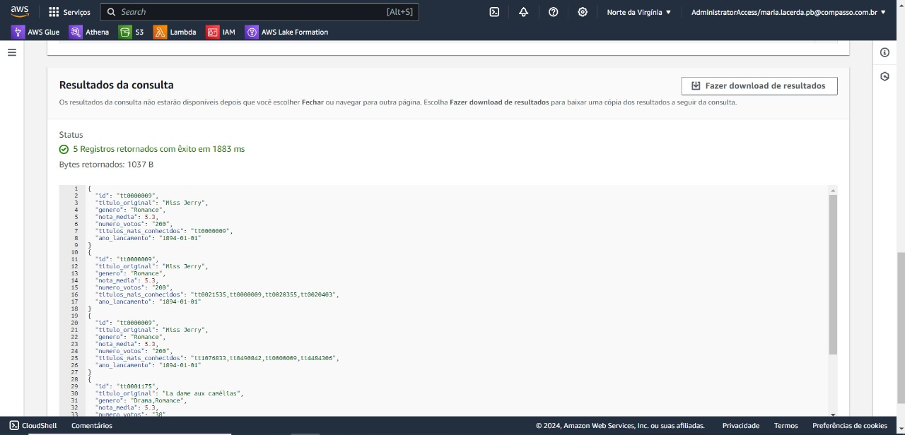
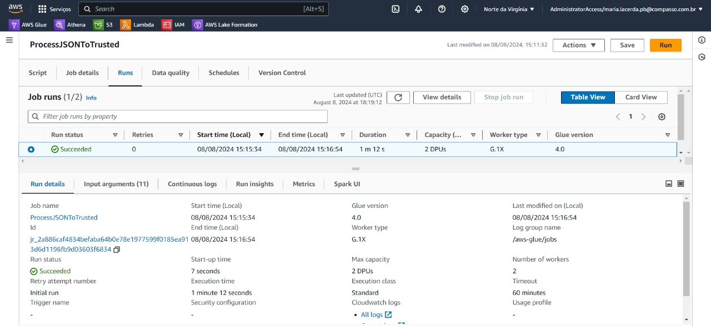
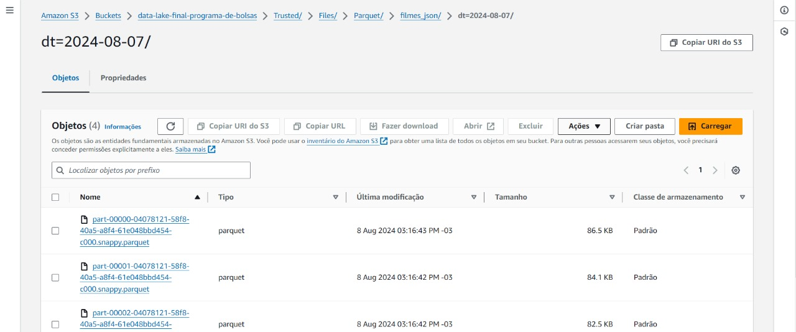
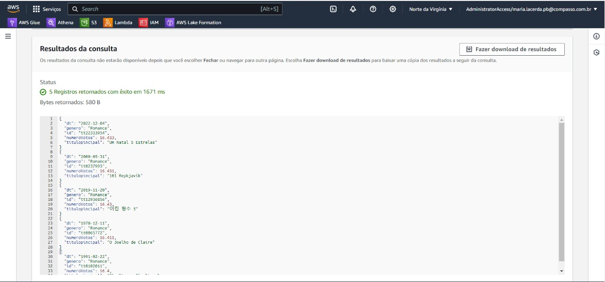
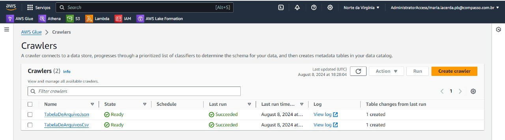
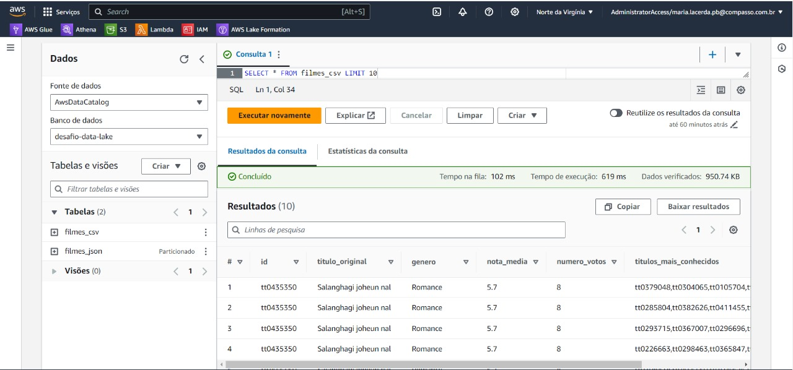
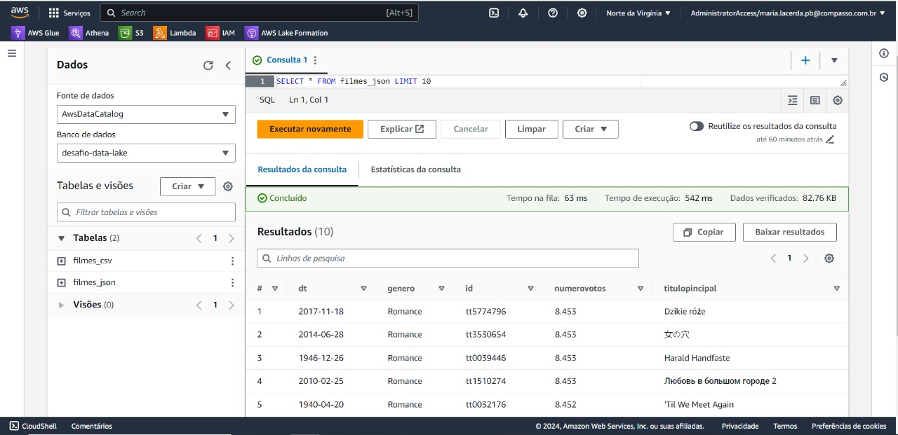
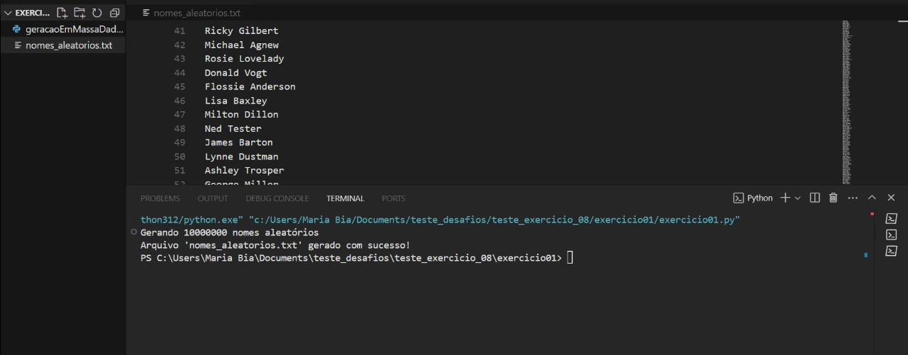

## Desafio Sprint 08

[Desafio](Desafio)

## Arquivo README contendo a explicação e atualização das minhas perguntas para a consulta de dados

[Readme](Desafio/README.md)

## Evidências de execução do Desafio

Status de execução do job destinado ao arquivo csv ```movies.csv```



Evidência de que todos os arquivos parquet foram salvos de forma correta no bucket no path ```s3://data-lake-final-programa-de-bolsas/Trusted/Files/Parquet/filmes_csv/dt=2024-08-07/```



Evidência de que todos os arquivos parquet contém os dados do arquivo csv ```movies.csv``` e estão com os dados que eu solicitei na filtragem de dados.



Status de execução do job destinado aos arquivos json no path ```s3://data-lake-final-programa-de-bolsas/Raw/TMDB/JSON/2024/08/07/```. Retirados novamente do TMDB na data de 07-08-2024 por motivos de correção dos dados e filtragem mais detalhada.



Evidência de que todos os arquivos parquet foram salvos de forma correta no bucket no path ```s3://data-lake-final-programa-de-bolsas/Trusted/Files/Parquet/filmes_json/dt=2024-08-07/```



Evidência de que todos os arquivos parquet contém os dados dos arquivos json e estão com os dados que eu solicitei na filtragem de dados.



Evidência de que os crawlers referentes as pastas de em que estão os arquivos parquet foram processados e transformados em tabelas.



Evidência de que a tabela referente aos dados parquet de origem do ```s3://data-lake-final-programa-de-bolsas/Trusted/Files/Parquet/filmes_json/dt=2024-08-07/``` foram transformados em tabela e já respondem corretamente a consultas SQL.



Evidência de que a tabela referente aos dados parquet de origem do ```s3://data-lake-final-programa-de-bolsas/Trusted/Files/Parquet/filmes_csv/dt=2024-08-07/``` foram transformados em tabela e já respondem corretamente a consultas SQL.



## Exercícios da Sprint 08

[Exercicios](Exercicio)

## Evidencia de execução do exercício de Geração em massa de dados




