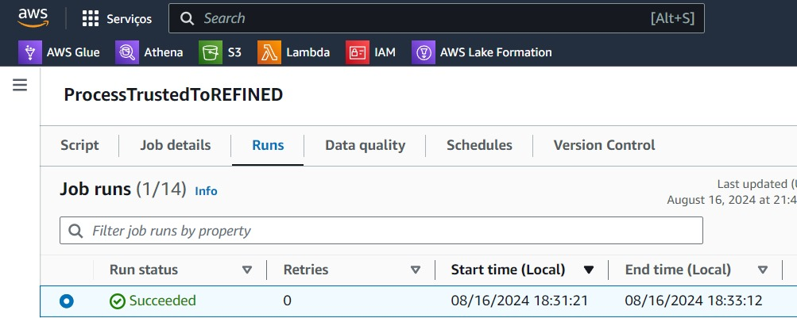
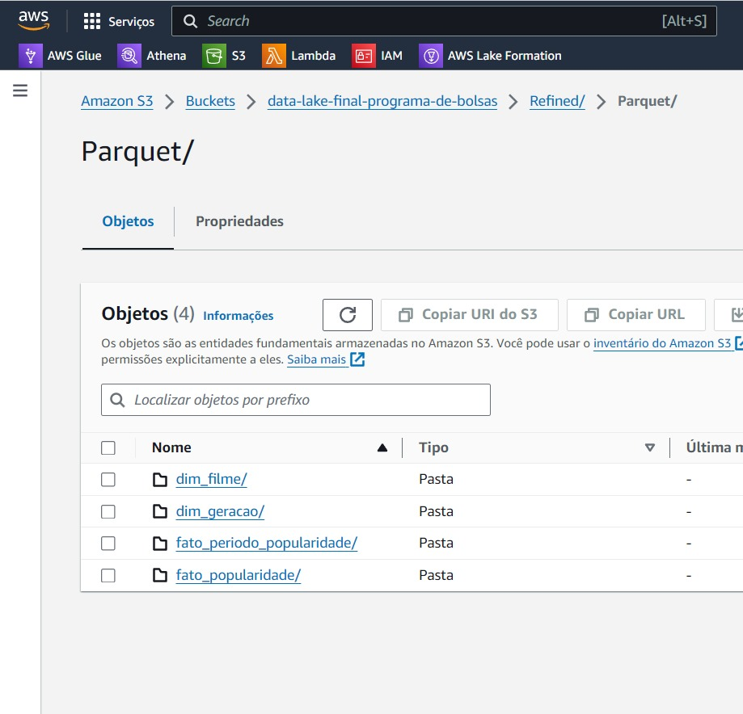
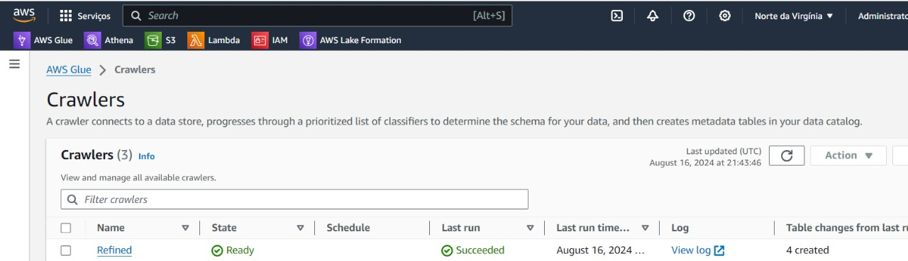
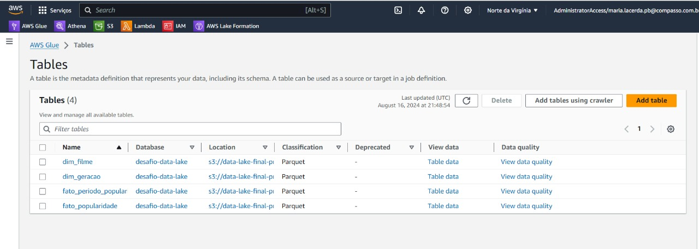
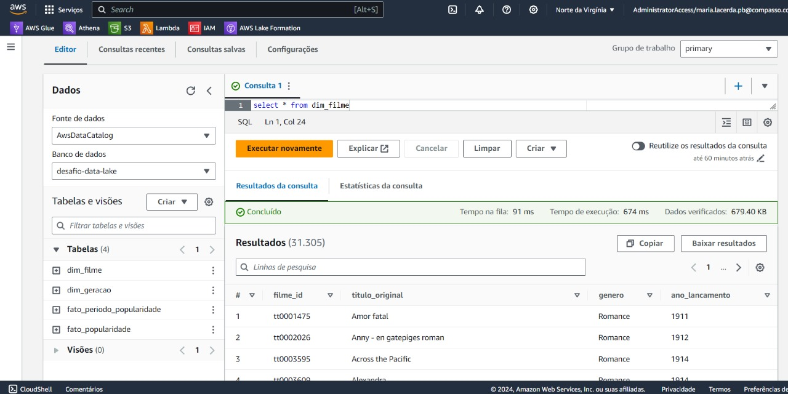
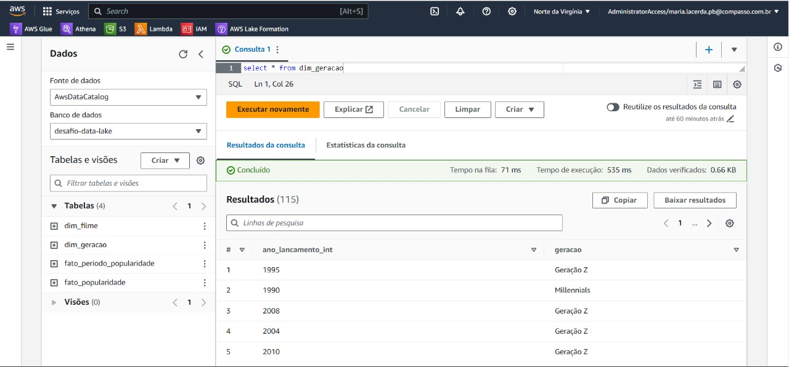
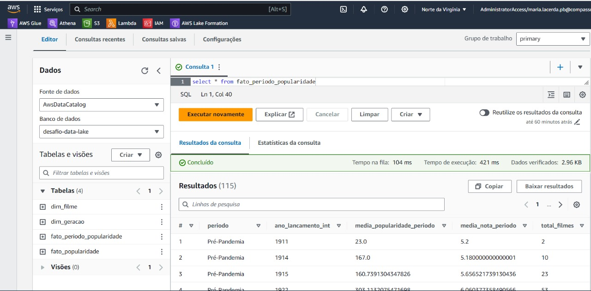
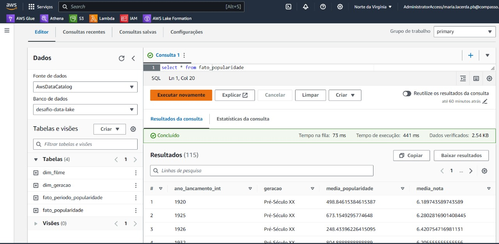

## Desafio 

[Desafio](Desafio)

#### As perguntas do desafio foram alteradas para atingir o seu objetivo com mais clareza.

```Quais filmes de romance foram lançados no mesmo ano durante os anos 2019 e 2024 e qual a média de popularidade desses filmes por ano?```

Essas perguntas são para evidenciar se houve uma diferença de popularidade dos filmes no período de anos pré-pândemia, durante a pândemia e pós-pândemia.


```Qual geração mais consome filmes de romance e mais bem avalia esses filmes```

Essa pergunta ela mostra a diferência de procura e popularidade de filmes de românce no final do século XX e atual no século XXI, e questionar se as diferentes gerações gostam de filmes de romance da mesma forma

## Evidências de execução do desafio 

Primeiramente temos o status de que o job que cria a camada Refined foi executado com sucesso.



Agora é possível perceber que não houve erros mesmo, pois a camada foi escrita no bucket com o caminho e os nomes corretos.



Então depois do job executado é possível usar o crawler para criar as tabelas em um data base, e a imagem demonstra que o crawler também criou as tabelas de forma correta.



Então no AWS Glue pude conferir se as tabelas haviam sido criadas com os nomes corretos e com os schemas desejados, e estava tudo conforme o esperado



Por fim pude analizar os dados das tabelas, através do AWS Athena, para conferir se tinha exatamente o que eu queria do job, e o resultado foi satisfatório.







