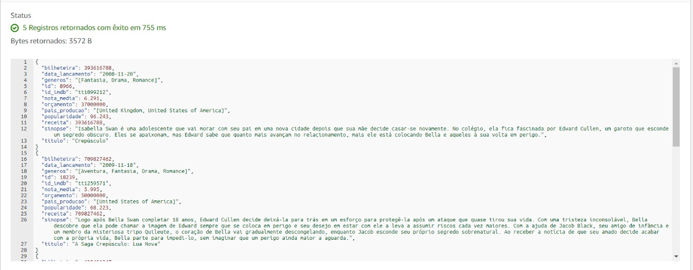
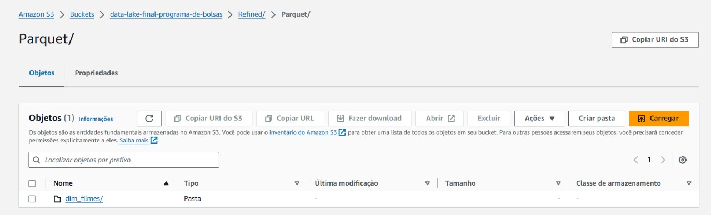
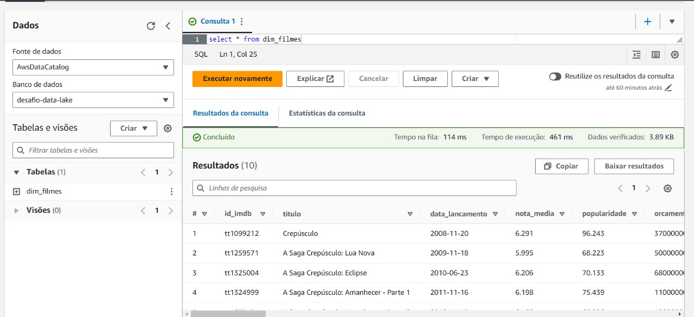
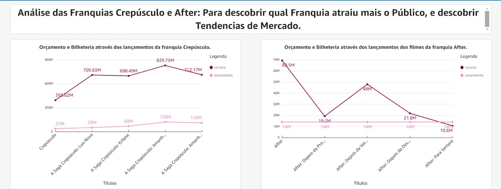
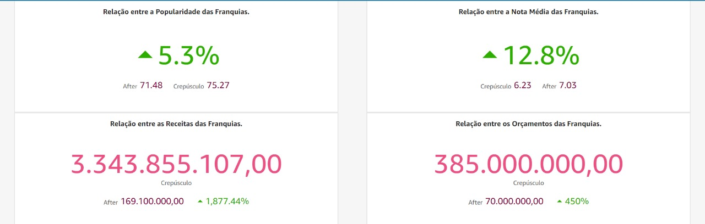
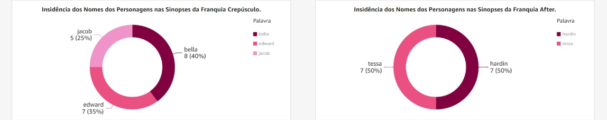

## Desafio 

[Desafio](Desafio)

#### As perguntas do desafio foram alteradas para atingir o seu objetivo com mais clareza.

```Qual filme é o mais popular e qual tem maior nota das franquias Crepúsculo e After?```

Essas perguntas são para evidenciar se há diferenças significativas entre os dois filmes que poderiam indicar que há variáveis particulares que podem interferir no sucesso das duas franquias.


```Qual o maior bilheteria e orçamento entre os filmes das franquias Crepúsculo e After?```

Essa pergunta demonstra se um maior investimento pode estar relacionado ao sucesso das franquias.

```Quais personagens são mais citados nas sinopses dos filmes das franquias Crepúsculo e After?```

Essa pergunta é para que possamos saber se os nomes mais evidenciados nas sinopses são de personagens femininos ou masculinos, para que possamos ver qual das franquias pode estar valorizando mais a figura feminina na divulgação.

## Evidências de execução do desafio 

Primeiramente temos o resultado da função lambda que eu precisei refazer para etender minha demanda.


Logo após temos o resultado do job trusted que eu também precisei refazer para etender minha demanda.




E depois temos o resultado do job refined que eu também precisei refazer para etender minha demanda.




## Evidências do Deshboard 

Gráfico de Linha referente aos orçamento e bilheteria das franquias Crepúsculo e After.



Indicador de Desempenho referente aos orçamento, bilheteria, popularidade e nota média das franquias Crepúsculo e After.



Gráfico de Rosca referente insidência dos nomes dos personagens principais nas sinopses das franquias Crepúsculo e After.

